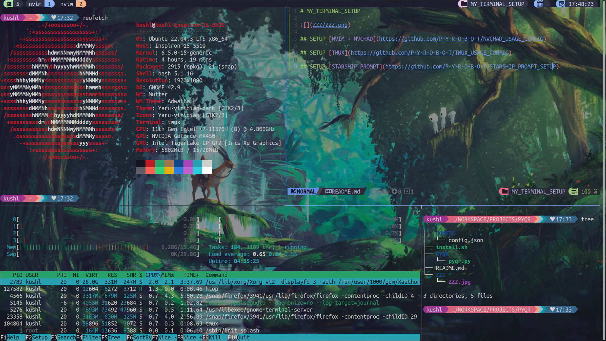

# MY_TERMINAL_SETUP

## SETUP [NVIM + NVCHAD](https://github.com/P-Y-R-O-B-O-T/NVCHAD_USAGE_CONFIG)

## SETUP [TMUX](https://github.com/P-Y-R-O-B-O-T/TMUX_USAGE_CONFIG)

## SETUP [STARSHIP PROMPT](https://github.com/P-Y-R-O-B-O-T/STARSHIP_PROMPT_SETUP)
